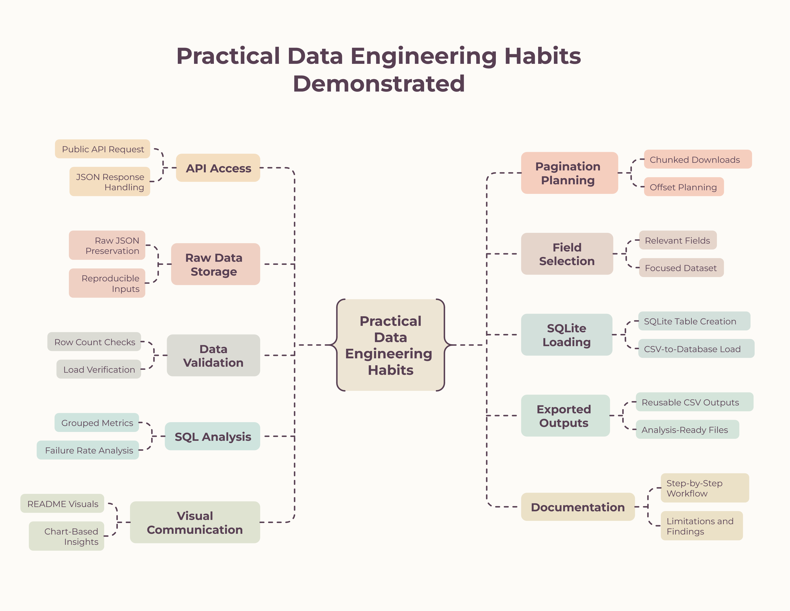
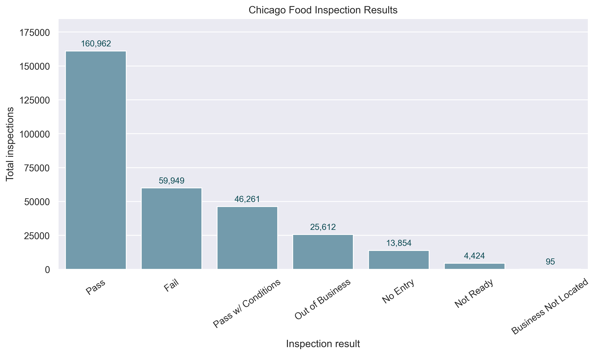
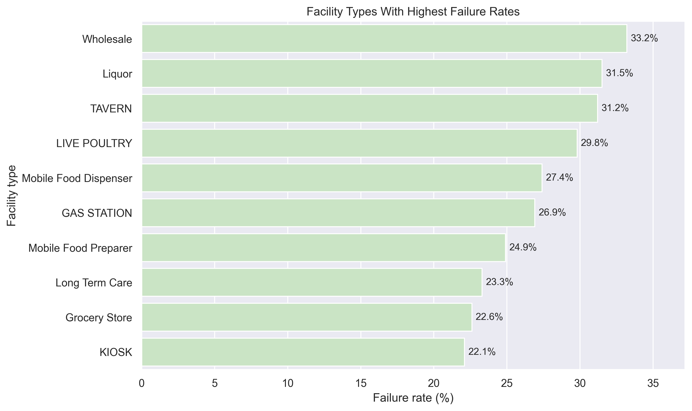
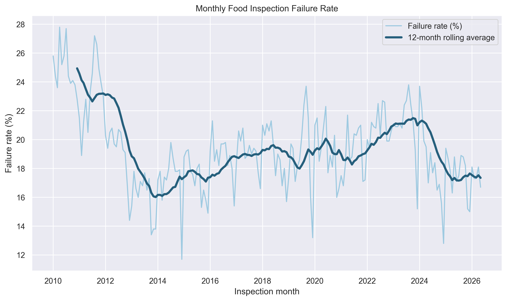

# Restaurant Inspection Risk & Compliance Analytics

Beginner data-engineering and SQL analytics project using official City of Chicago food inspection data.

The project builds an explainable pipeline from a public API response to a SQLite database, then uses SQL and Python visualizations to identify inspection outcome patterns, facility-type failure rates, and long-term failure-rate trends.

## Learning Focus

This project was built as part of my transition into Data Analytics and Data Science, with a focus on developing practical data-engineering habits: working with a public API, planning paginated downloads, validating row counts, loading data into SQLite, and turning SQL outputs into analytical insights.

Rather than using a pre-cleaned dataset, I built the workflow from raw API access to final visual summaries. The project demonstrates my ability to learn technical tools systematically, document each step clearly, and produce reproducible analysis that can be reviewed and extended.



## Business Question

How can Chicago food inspection records be used to identify patterns in inspection outcomes, facility-type failure rates, and violation presence?

The final analysis uses the full API extract available at the time of the project: **311,157 inspection records**.

## Data Source

- Source: [City of Chicago Food Inspections](https://data.cityofchicago.org/Health-Human-Services/Food-Inspections/4ijn-s7e5)
- Publisher: City of Chicago
- Format used in this project: Socrata API JSON response
- Final dataset size used: 311,157 inspection records

## Pipeline


```text
API
-> raw JSON chunks
-> selected inspection fields
-> cleaned CSV
-> SQLite database
-> verification queries
-> SQL analysis
-> exported analysis CSVs
-> README visual highlights
```

## Visual Highlights

### Inspection Result Distribution



Across 311,157 Chicago food inspection records, 66.6% of inspections resulted in a pass or pass with conditions, while 19.3% failed. This establishes the baseline risk level before comparing failure rates by facility type, ZIP code, and inspection period.

### Facility Types With Highest Failure Rates



Among facility types with at least 100 inspections, Wholesale facilities had the highest failure rate at 33.2%, followed by Liquor establishments at 31.5% and Taverns at 31.2%. This suggests that inspection risk varies meaningfully by facility category, not only by overall inspection volume.

### Monthly Failure Rate Trend



Monthly failure rates were generally higher in early records, around 24-28% in early 2010, compared with roughly 17-18% in early 2026. This suggests a possible long-term decrease in recorded inspection failure rates, which should be interpreted carefully because inspection practices, reporting rules, and business conditions may have changed over time.

## Additional Finding

Violation text is present for nearly all failed inspections (94.0%) and pass-with-conditions inspections (98.0%), but also appears in 75.3% of passed inspections. This means violation text should not be interpreted as equivalent to failure; it is better treated as supporting inspection detail rather than a simple pass/fail flag.

## What This Project Demonstrates

- Requesting JSON data from a public API
- Checking full dataset size before downloading
- Planning paginated API requests with offsets
- Downloading large API data in chunks
- Saving raw API responses locally
- Selecting relevant fields from inspection records
- Converting cleaned JSON records into CSV
- Creating SQLite database tables from Python
- Loading CSV records into SQLite
- Verifying database loads with SQL checks
- Writing SQL analysis queries with grouping, conditional counts, percentages, and time-based summaries
- Exporting SQL results as reusable CSV files
- Creating README-ready visualizations from analysis outputs

## Repository Structure

```text
.
|-- data/
|   |-- raw/             # ignored raw API/data files
|   `-- processed/       # ignored generated cleaned/export files
|-- database/            # ignored SQLite database files
|-- reports/             # written findings and summaries
|-- scripts/             # Python pipeline, SQL analysis, and chart scripts
|-- images/              # pipeline diagram and README chart images
|-- README.md
`-- requirements.txt
```

## Main Scripts

| Script | Purpose |
|---|---|
| `01_fetch_api_sample.py` | Fetch 10 API records and inspect the JSON structure |
| `02_select_fields.py` | Keep relevant fields from the 10-row sample |
| `03_clean_json_to_csv.py` | Convert cleaned JSON to CSV |
| `04_fetch_api_sample_1000.py` | Fetch the 1,000 most recent API records |
| `05_clean_api_sample_1000.py` | Save cleaned 1,000-row JSON and CSV files |
| `06_create_sqlite_table.py` | Create the sample SQLite `inspections` table |
| `07_load_csv_to_sqlite.py` | Load the 1,000-row cleaned CSV into SQLite |
| `08_verify_sqlite_load.py` | Check row counts and result categories for the sample database |
| `09_analyze_results_distribution.py` | Calculate sample inspection result distribution |
| `10_failure_rate_by_facility_type.py` | Calculate sample failure rates by facility type |
| `11_violation_presence_by_result.py` | Compare sample violation text presence by result |
| `12_inspections_over_time.py` | Analyze sample monthly inspection volume and failure rates |
| `13_export_monthly_inspection_summary.py` | Export sample monthly summary metrics to CSV |
| `14_export_facility_failure_rates.py` | Export sample facility-type failure rates to CSV |
| `15_check_full_dataset_size.py` | Request the full API row count |
| `16_plan_pagination_offsets.py` | Calculate offsets for full-dataset chunk downloads |
| `17_download_first_chunk.py` | Test full-dataset download logic on one chunk |
| `18_download_all_chunks.py` | Download the full dataset in JSON chunks |
| `19_clean_all_chunks_to_csv.py` | Clean all JSON chunks into one full CSV file |
| `20_create_full_sqlite_table.py` | Create the full SQLite `inspections` table |
| `21_load_full_csv_sqlite.py` | Load the full cleaned CSV into SQLite |
| `22_verify_full_sqlite_load.py` | Verify full database row counts and result categories |
| `23a_export_full_result_distribution.py` | Export full result distribution metrics |
| `23b_export_full_facility_failure_rates.py` | Export full facility-type failure rates |
| `23c_export_full_monthly_inspection_summary.py` | Export full monthly failure-rate summary |
| `23d_export_full_violation_presence_by_result.py` | Export full violation presence by inspection result |
| `24a_create_full_analysis_charts.py` | Create the result distribution chart |
| `24b_top_facility_failure_rates_chart.py` | Create the facility failure-rate chart |
| `24c_monthly_failure_rate_trend.py` | Create the monthly failure-rate trend chart |

## How To Run

Run scripts from the project root:

```powershell
cd D:\git\restaurant-inspection-risk-analytics
```

In PyCharm, set the working directory to:

```text
D:\git\restaurant-inspection-risk-analytics
```

Install dependencies:

```powershell
pip install -r requirements.txt
```

To rebuild the full analysis pipeline:

```powershell
python scripts\15_check_full_dataset_size.py
python scripts\16_plan_pagination_offsets.py
python scripts\17_download_first_chunk.py
python scripts\18_download_all_chunks.py
python scripts\19_clean_all_chunks_to_csv.py
python scripts\20_create_full_sqlite_table.py
python scripts\21_load_full_csv_sqlite.py
python scripts\22_verify_full_sqlite_load.py
python scripts\23a_export_full_result_distribution.py
python scripts\23b_export_full_facility_failure_rates.py
python scripts\23c_export_full_monthly_inspection_summary.py
python scripts\23d_export_full_violation_presence_by_result.py
```

To recreate the README charts:

```powershell
python scripts\24a_create_full_analysis_charts.py
python scripts\24b_top_facility_failure_rates_chart.py
python scripts\24c_monthly_failure_rate_trend.py
```

## Generated Files

Raw API files, cleaned CSV files, and SQLite databases are generated locally and ignored by Git.

Key generated analysis outputs:

```text
data/processed/full_result_distribution.csv
data/processed/full_facility_failure_rates.csv
data/processed/full_monthly_inspection_summary.csv
data/processed/full_violation_presence_by_result.csv
```

The README chart images are tracked so the visual highlights render on GitHub.

## Next Steps

- Polish chart styling for a more consistent visual identity.
- Add ZIP-code level risk analysis.
- Parse individual violation codes into a separate table.
- Add a short data-quality section explaining limits of violation text and historical trend interpretation.
